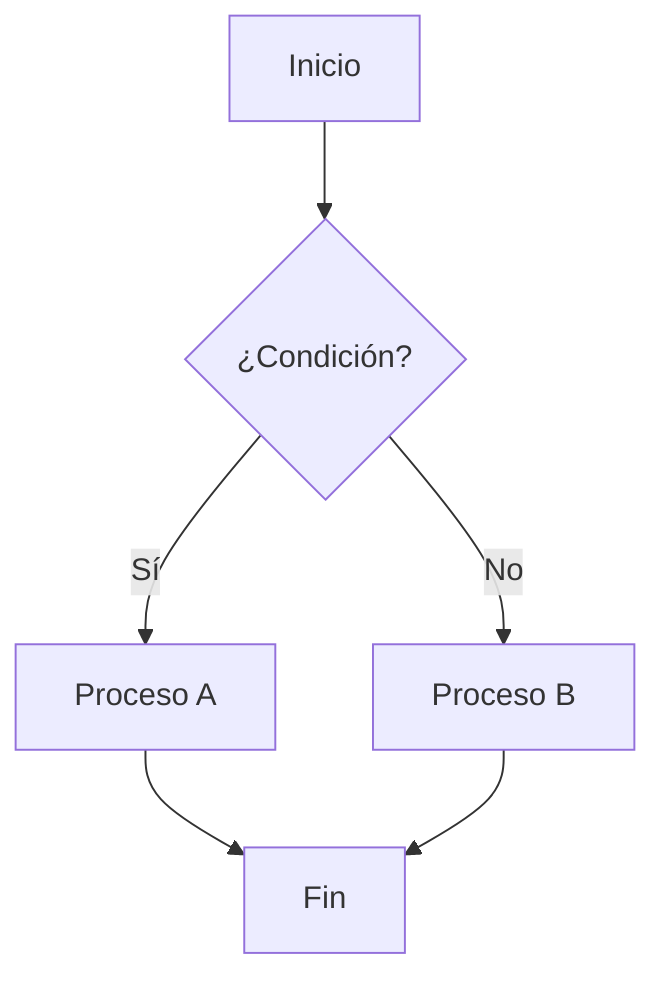
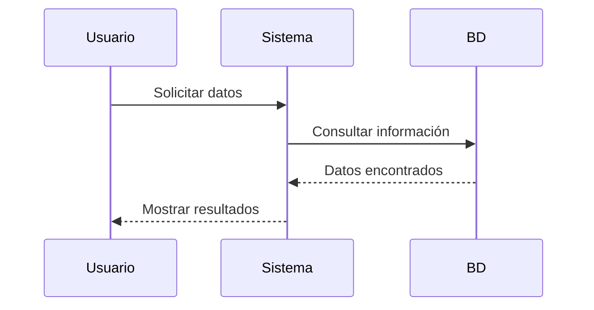
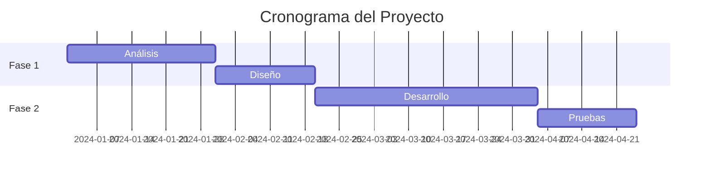
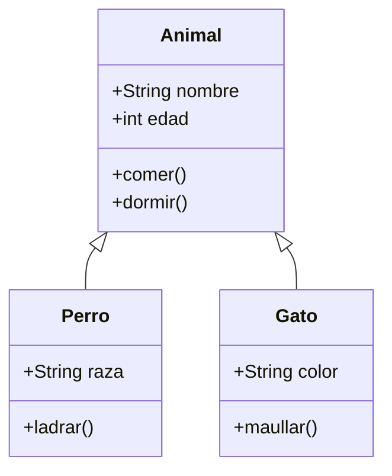
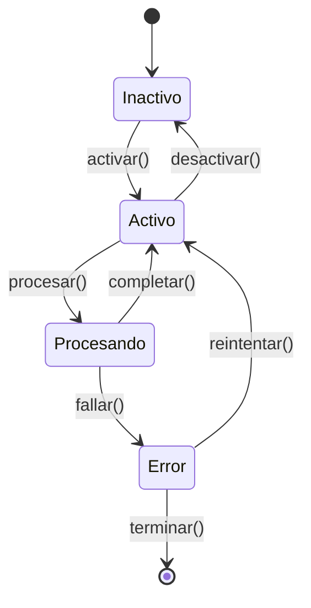
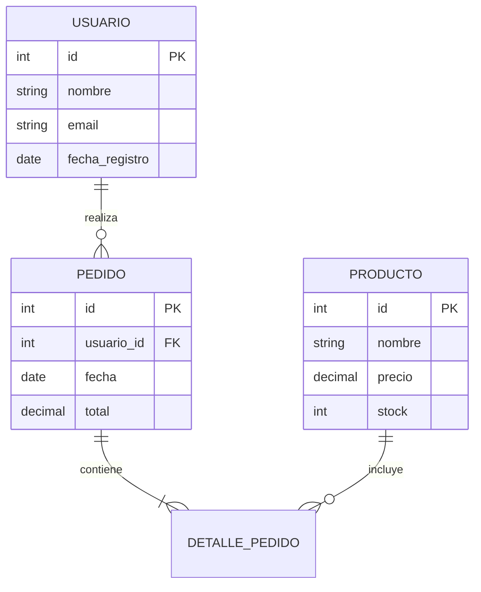
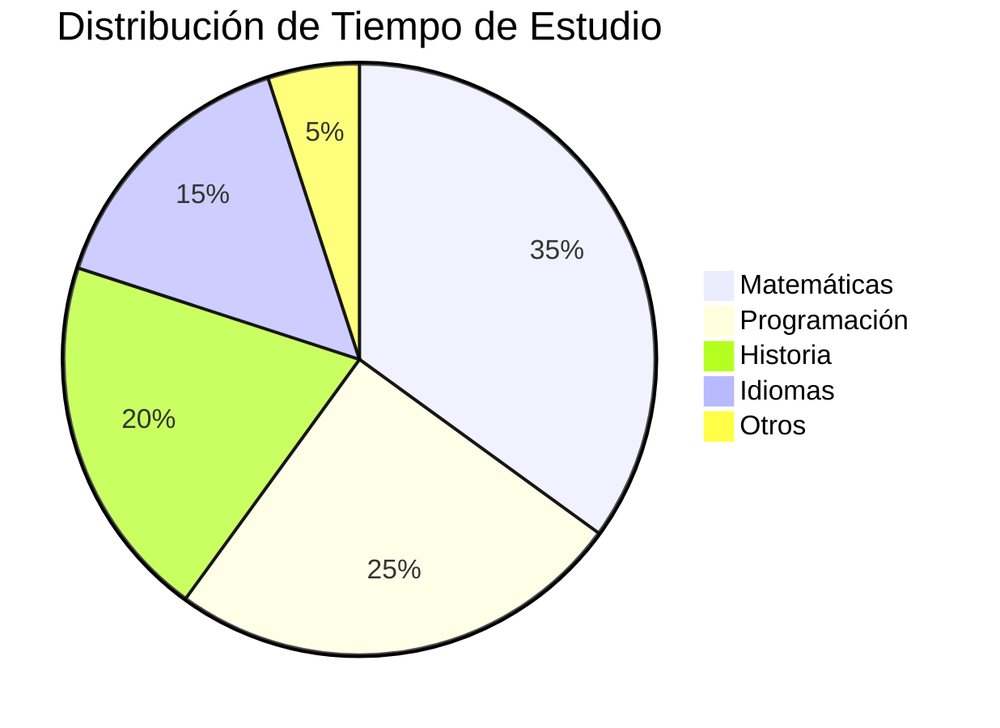
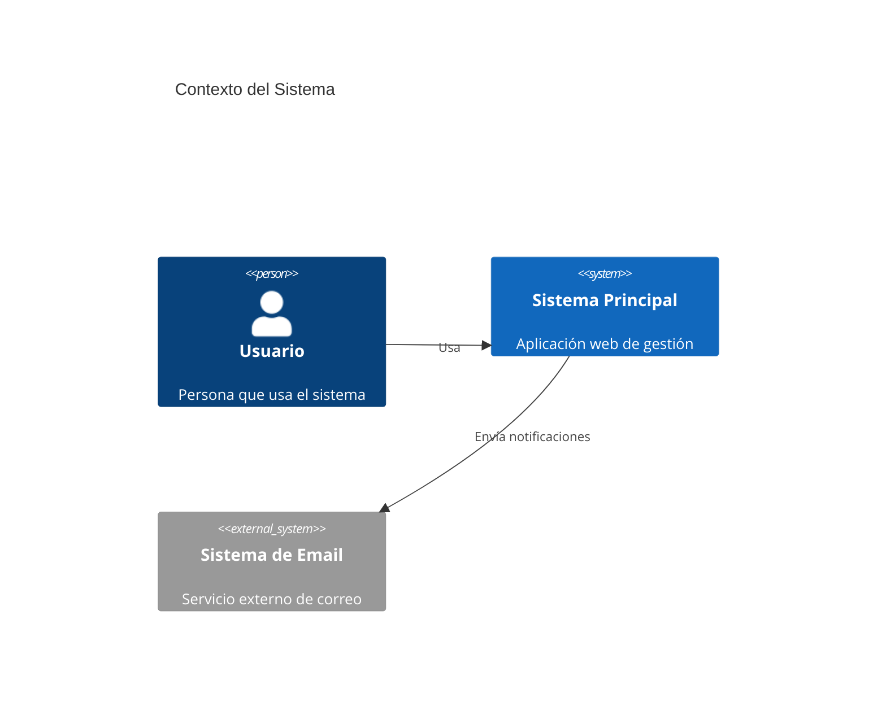
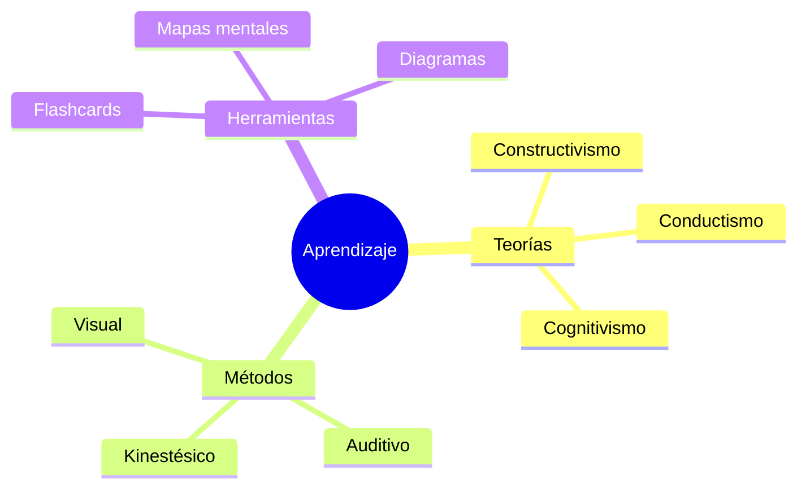

# Ejemplos de Diagramas Mermaid

Esta guía contiene ejemplos de diferentes tipos de diagramas Mermaid que puedes usar en tus notas y flashcards.

## 1. Diagrama de Flujo (Flowchart)



## 2. Diagrama de Secuencia



## 3. Diagrama de Gantt



## 4. Diagrama de Clases



## 5. Diagrama de Estado



## 6. Diagrama de Entidad-Relación



## 7. Diagrama de Pastel (Pie Chart)



## 8. Diagrama de Git

```mermaid
gitgraph
    commit id: "Inicial"
    branch develop
    checkout develop
    commit id: "Feature A"
    commit id: "Feature B"
    checkout main
    merge develop
    commit id: "Release v1.0"
```

## 9. Diagrama de Arquitectura C4



## 10. Mapa Mental



## Cómo Usar en tu Editor

1. **En el editor de notas**: Simplemente escribe un bloque de código con el lenguaje `mermaid`:
   ````markdown
   ```mermaid
   flowchart TD
       A --> B
   ```
   ````

2. **En flashcards**: Puedes incluir diagramas tanto en la pregunta como en la respuesta de tus flashcards.

3. **Modo de estudio**: Los diagramas se renderizarán automáticamente cuando visualices tus notas o estudies con flashcards.

## Consejos de Uso

- **Simplicidad**: Mantén los diagramas simples y claros
- **Colores**: Mermaid usa un tema oscuro que combina con tu editor
- **Tamaño**: Los diagramas se ajustan automáticamente al contenedor
- **Errores**: Si hay un error en la sintaxis, se mostrará un mensaje de error con el código para que puedas corregirlo

¡Experimenta con estos ejemplos y crea tus propios diagramas para mejorar tus notas de estudio!
